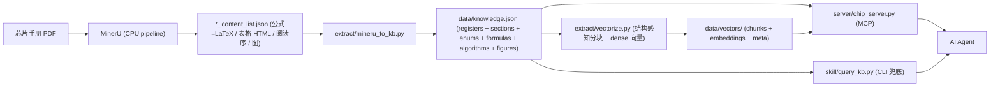

# chip-manual-kit

把**芯片手册 PDF** 转成 **AI agent 可检索的编程知识库**，指导寄存器级软件开发
（code review / 写驱动 / 自动加注释）。厂商无关，Cursor / Claude Code / Copilot 均可接入。

管线三段：**PDF → knowledge.json → 查询（MCP 或 CLI）**。



一键复现（工具无关，Cursor / VS Code / Claude Code 均可调用同一入口）：

```bash
# CHIP_PYTHON 指向带 torch/sentence-transformers 的解释器；--embed-model 用本地模型路径可离线
python scripts/build_kb.py --mineru-out OUT_DIR1 OUT_DIR2 ... --embed-model /path/to/bge-small-en-v1.5
# 或用薄封装：scripts/build.ps1（Windows）/ scripts/build.sh（Linux/macOS）
```

## 目录

| 路径 | 作用 |
|---|---|
| `extract/mineru_to_kb.py` | MinerU 输出 → `knowledge.json`（推荐，含公式/枚举/算法/图） |
| `extract/pdf_to_json.py` | 旧版 pdfplumber 抽取（仅寄存器/位域，无公式，作对照/降级） |
| `server/chip_server.py` | FastMCP server，工具 `search_registers` / `search_concepts` |
| `skill/chip-manual-kit/` | 可移植 Agent Skill（`SKILL.md` + `query_kb.py` CLI 兜底） |
| `data/knowledge.json` | 生成的知识库（手册派生物，默认 `.gitignore`） |
| `examples/mcp.json.template` | MCP 客户端配置模板 |
| `eval/` | 检索评测：`questions.jsonl` + `run_eval.py`，量化 hit@1/hit@5（见 `eval/README.md`） |
| `extract/audit_source.py` / `validate_kb.py` | 新厂商源格式审计 + 生成知识库结构/覆盖率验证 |
| `docs/ADAPTING_AND_TESTING.md` | 换厂商手册的 golden-slice 适配与四层测试方法 |

## 知识库 schema

见 `skill/chip-manual-kit/SKILL.md`。相比"只有寄存器"的旧方案，新增：
- 位域列 `access` / `reset_value` / `typical_value`
- `enums`：错误码/枚举表（Value/Mnemonic/Description），对应 C 里的 `*_ERROR_E` 常量
- `formulas`：MinerU 识别的 LaTeX 行间公式
- `algorithms`：伪代码/算法块
- `figures`：框图/图片及图题
- `section_id`：寄存器↔章节的显式外键

## 快速开始

### 1) 生成知识库（换手册时重跑）
```bash
# 安装（CPU；国内网络设 MINERU_MODEL_SOURCE=modelscope）
python -m venv .venv && .venv/Scripts/activate      # Windows
pip install -U uv && uv pip install "mineru[core]" beautifulsoup4
mineru-models-download -s modelscope -m pipeline    # 首次，下载 ~2GB 模型

# 解析（CPU 用 -b pipeline；localhost 走代理会 403，需设 NO_PROXY）
set NO_PROXY=127.0.0.1,localhost
mineru -p manual.pdf -o out -b pipeline
python extract/mineru_to_kb.py --input out -o data/knowledge.json

# 可选：为 prose 建语义向量索引（启用 search_prose 混合检索）
#   模型经 ModelScope 下载到本地：modelscope download BAAI/bge-small-en-v1.5
python extract/vectorize.py --kb data/knowledge.json --out data/vectors \
  --model /path/to/bge-small-en-v1.5
```

### 适配其它厂商手册（先小样、后全量）

不要直接盲跑整本。先选含地址表、位域表、枚举、正文和框图的 10–30 页 golden slice：

```bash
python extract/audit_source.py --input out_golden
cp examples/extraction-profile.json.template my-profile.json
# 按 audit 输出的真实表头/寄存器命名修改 profile，再审计一次
python extract/audit_source.py --input out_golden --profile my-profile.json
python scripts/build_kb.py --mineru-out out_golden --profile my-profile.json \
  --embed-model /path/to/embed-model
python extract/validate_kb.py --kb data/knowledge.json
python eval/validate_questions.py --questions eval/my-questions.jsonl --kb data/knowledge.json
python eval/run_eval.py --questions eval/my-questions.jsonl
```

完整方法、验收门槛和 fixture 测试见 [`docs/ADAPTING_AND_TESTING.md`](docs/ADAPTING_AND_TESTING.md)。

### 2A) 接入 MCP —— 形态 A：本地 stdio（默认，推荐单机）
把 `examples/mcp.json.template` 里的 `/ABS/PATH/TO/` 换成绝对路径，写入客户端 MCP 配置：
- Cursor：项目 `.cursor/mcp.json` 或全局 `~/.cursor/mcp.json`（键 `mcpServers`）
- Claude Code：项目根 `.mcp.json`
- Windows：`command` 指向 `.venv\Scripts\python.exe`

客户端会按需拉起 `chip_server.py`（默认 stdio），模型在该进程内加载一次并常驻。

### 形态 B：常驻 HTTP 服务（部署到服务器，多客户端共享）
在服务器上启动常驻服务（streamable-http，端点默认 `/mcp`）：
```bash
# 直接跑，或用 scripts/serve_http.sh / serve_http.ps1（会带上离线环境变量）
CHIP_KB_PATH=.../data/knowledge.json CHIP_VECTORS_PATH=.../data/vectors \
CHIP_EMBED_MODEL=.../bge-small-en-v1.5 \
python server/chip_server.py --http --host 0.0.0.0 --port 8000
```
客户端改用 `examples/mcp.remote.json.template`（URL 方式，本地零依赖）：
```json
{ "mcpServers": { "chip-manual-kit": { "url": "http://SERVER_HOST:8000/mcp" } } }
```
- 传输方式也可用环境变量注入：`CHIP_MCP_TRANSPORT`（stdio｜streamable-http｜sse）、`CHIP_MCP_HOST`、`CHIP_MCP_PORT`。
- 算力提示：**运行期查询很轻**（BM25 纯 CPU + 单条 query 编码 + numpy 余弦），普通 CPU 即可；**GPU 的价值主要在构建期**（MinerU 解析 + 一次性 vectorize）。可在 GPU 机器上构建，把 `data/` 拷到服务器常驻即可。
- 注意：对外暴露需自行加鉴权/反向代理；`knowledge.json` 为厂商手册派生物，限内网使用。

两种形态暴露的是同一套三个互补工具：
- `search_registers(query, module="")` — **结构化/精确**：寄存器地址/位域/复位值 + 所属章节解说
- `search_concepts(query, module="")` — **关键词**：原理/公式/算法/枚举/表/图，解释 error code
- `search_prose(query, module="", top_k=5, rerank=True)` — **混合检索**：BM25 词法 + dense 向量，
  RRF 融合，可选 cross-encoder 精排。适合"既含标识符又含概念"的自然语言问题（"how does DROP_CNT
  saturation work"）。**融合/重排全在服务端完成，默认只返回 top 5**，不把几十条粗召回塞进上下文。

选型建议：只要精确寄存器名/地址/位域用 `search_registers`；混合问题用 `search_prose`。三者可叠加。

### 混合检索原理（search_prose）

```
query ──► BM25 词法召回 (top ~30, 标识符感知分词 + 英文轻量词干归一)
      └─► dense 向量召回 (top ~30, bge-small-en-v1.5)
                       │
                RRF 融合 (k=60) ──► 候选池 ~30
                       │
         (可选) cross-encoder 精排 (bge-reranker-base, 本地 CPU)
                       │
                返回 top 5（title / breadcrumb / page / text / 各路分数）
```

- **BM25** 纯标准库实现（`server/retrieval.py`），离线可复现；完整保留寄存器标识符，并对普通英文词
  做保守轻量词干归一（如 dropped/dropping/drops → drop），兼顾精确 token 与自然语言召回。
- **dense** 需 `data/vectors/`（`extract/vectorize.py` 生成）；缺失时自动降级为纯 BM25。
- **rerank** 可选：设 `CHIP_RERANK_MODEL` 指向本地 `bge-reranker-base`（`modelscope download
  BAAI/bge-reranker-base`）即启用；不设或加载失败则跳过，仅用 RRF。
- **上下文可控**：单招提升 precision 最明显的是重排；返回条数默认 5，避免注意力稀释（本地 vLLM 亦然）。

### 结构感知分块（vectorize.py）

- 一个 section / 表 / 寄存器 / 枚举 / 算法尽量作为**一个** chunk，超长才按句界带重叠拆分，避免切碎语义。
- 每个 chunk 的 embedding 文本前拼「module › 章节/单元标题」面包屑，补足层级上下文。
- 语料涵盖 sections / algorithms / registers / enums / tables / markdown，使混合检索能覆盖标识符与概念。
- 分块参数与模型写入 `data/vectors/meta.json`，索引自描述，任意工具可按同一配置复现。

### 2B) 禁用 MCP 的环境 → CLI（零依赖）
```bash
python skill/chip-manual-kit/query_kb.py --data data/knowledge.json --query ctrl_status --module ACME
python skill/chip-manual-kit/query_kb.py --data data/knowledge.json --mode concepts --query "receive overflow" --module ACME
```

## 已知限制与语料增强路线（roadmap）

MinerU 用 OCR 识别版面，个别字符可能误识（如 `0↔O`），对角水印偶有残留。关键地址/位宽请以
`page` 字段回查原 PDF。后续增强方向：
- **公式/逻辑增强**：对含数学的章节，校正 LaTeX、把散落公式与相关寄存器/位域交叉引用。
- **语料清洗**：更强的水印/页眉页脚剥离、OCR 纠错词典（`0/O`、`l/1`、粘连词分词）。
- **交叉引用**：`enums.values[].description` 里出现的 `REG[FIELD]` 自动链接到对应 register/bit_field。
- **数字优先**：对可提取文本层的 PDF，融合 pdfplumber 精确文本 + MinerU 结构/公式，减少 OCR 误差。

## 许可证
MIT（见 `LICENSE`）。注意：由厂商手册生成的 `knowledge.json` 版权归原厂商，勿随意公开。
