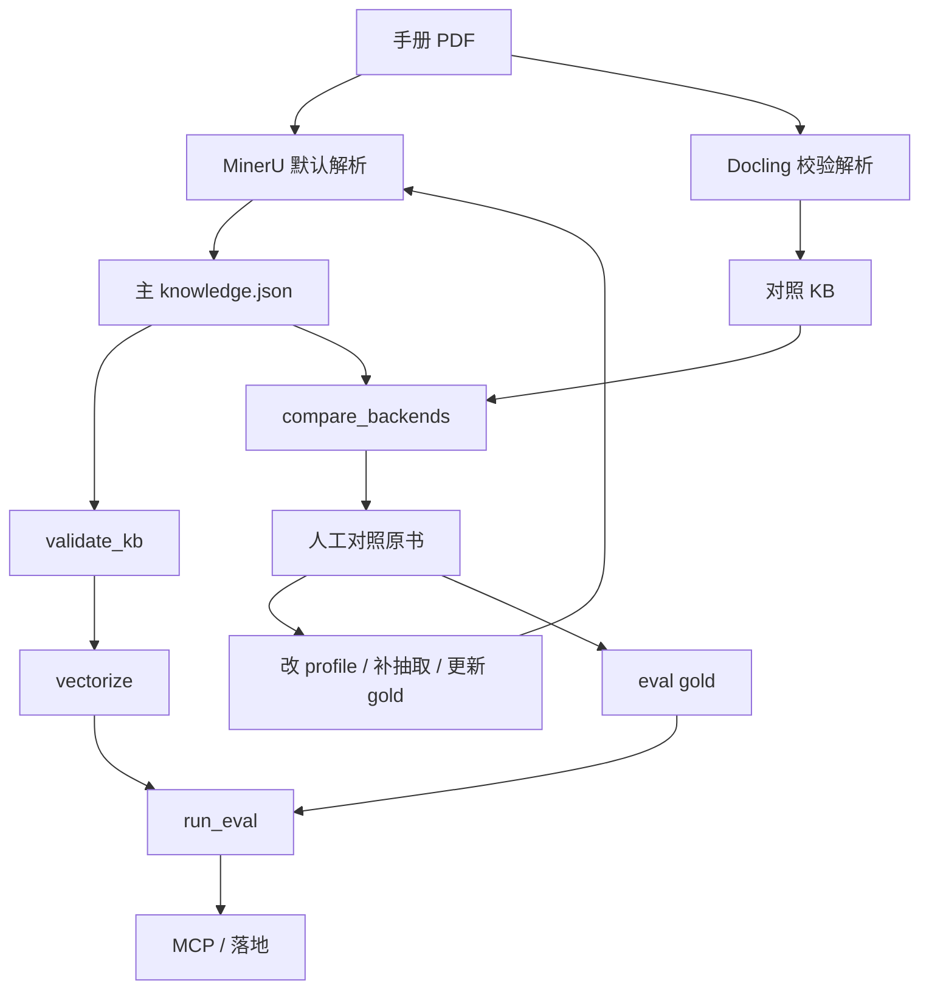

# chip-manual-kit 用户指南

面向：**把芯片手册做成可检索的 `knowledge.json`，并保证足够准确，供 agent / 驱动开发使用。**  
厂商适配细节见 [`ADAPTING_AND_TESTING.md`](ADAPTING_AND_TESTING.md)。

## 1. 默认策略（准确度优先）

| 角色 | 工具 | 用途 |
|---|---|---|
| **默认构建** | MinerU → `mineru_to_kb.py` → `data/knowledge.json` | 日常入库、MCP 查询所读的主知识库 |
| **校验对照** | Docling → 同形 KB → `compare_backends.py` | 找漏挂/地址分歧/位域差异；**不自动覆盖**主库 |
| **正确性裁决** | 原手册 PDF + 人工 gold | 两边不一致时以原书为准；工具只标「分歧」 |

原因简述：

- 主库需要**可复现、可审计、与现有全量管线一致**；MinerU 是当前默认生产路径。
- 单次样页上另一后端召回更好，**不等于**可无校验地替换默认；Docling 也会误报（短名位域升寄存器、空 caption 假图等）。
- `knowledge` 的目标是**准确**，不是「某一侧条目更多」。多出来的条目未经原书确认前，不应直接并入主库。

推荐闭环：

```text
MinerU 建主库 → validate_kb → Docling 同页/同册对照 → compare_backends
    → 人工抽查 only-A / only-B / 地址不一致 → 修 profile 或补 parser
    → 写入/更新 eval gold → 再跑 validate + run_eval → 通过后再全量
```

## 2. MinerU 默认构建（主路径）

```bash
mineru -p MODULE.pdf -o out_MODULE -b pipeline
python extract/audit_source.py --input out_MODULE --profile my-vendor-profile.json
python scripts/build_kb.py --mineru-out out_MODULE --profile my-vendor-profile.json \
  --embed-model /path/to/bge-small-en-v1.5
python extract/validate_kb.py --kb data/knowledge.json
```

MCP / CLI 只消费 **`data/knowledge.json` + `data/vectors/`**（或你通过 `CHIP_KB_PATH` / `CHIP_VECTORS_PATH` 指定的路径）。

## 3. 用 Docling 做校验（不替换默认）

**推荐做法：直接在 `build_kb.py` 上加 `--verify-with-docling`，一条命令自动做完，不用记两条命令。**

```bash
pip install docling   # 可选依赖；受限网络可设 HF_ENDPOINT 镜像

python scripts/build_kb.py --mineru-out out_MODULE --profile my-vendor-profile.json \
  --verify-with-docling MODULE.pdf
# 模块名默认取 PDF 文件名（不含扩展名）；不一致或多模块时用 MODULE=path 显式指定，可传多个：
#   --verify-with-docling ACME=acme.pdf FOO=foo.pdf
```

主库建完后会自动：用 Docling 重新解析 `MODULE.pdf` → 与主库里同 `module` 的切片对照
（不会把其它模块的寄存器算进来误报）→ 打印分歧报告 → 落盘到
`data/docling_compare_MODULE.json`。**全程不修改/不覆盖 `data/knowledge.json`。**
没装 `docling` 时会跳过并打印提示，主库仍正常生成，但整体退出码是 `3`（区分"建库失败"和
"建库成功但没做交叉校验"，方便脚本/CI 判断）。

如果想分两步手动跑（比如只想先跑 Docling 侧、还没准备好主库），仍然可以：

```bash
python extract/docling_to_kb.py --pdf MODULE.pdf --module ACME \
  --out-dir out_docling_MODULE \
  --output data/kb_docling_MODULE.json \
  --profile my-vendor-profile.json

python extract/compare_backends.py \
  --a data/knowledge.json \
  --b data/kb_docling_MODULE.json \
  --label-a mineru --label-b docling \
  --json compare-MODULE.json
```

### 3.1 报告怎么读

| 信号 | 含义 | 建议动作 |
|---|---|---|
| `only_docling` 多 | MinerU 可能**漏挂**寄存器 | 回原书确认；确认后修 profile/锚点逻辑，**再重建 MinerU 主库** |
| `only_mineru` 多 | Docling 可能漏，或 MinerU 多收了结构体/噪声 | 回原书；必要时加拒收规则（短名、明显位域名） |
| 共享寄存器**地址不一致** | 至少一侧抽错 | 以 PDF 汇总表为准，禁止静默取「有地址的一侧」 |
| 位域 mean Jaccard 偏低 | 列映射/OCR/跨页表问题 | 调 `bit_position_patterns` / 表头别名，并人工抽位域名 |
| Docling `figures` 暴增且无 caption | 常见误检 | 校验阶段可忽略图，主库仍以 MinerU 图为准 |

### 3.2 准确度原则（务必遵守）

1. **主库只来自默认 MinerU 路径**（除非你显式变更默认并完成全套 gold 回归）。
2. Docling 产出用于**找问题**，不用于无人值守合并进 `knowledge.json`。
3. 每个「准备采纳的差分」至少：**原书页码 + 寄存器名 + 地址（或明确无地址原因）** 记入 gold / 变更说明。
4. 修订主库后必须：`validate_kb` + 相关 `questions` 的 `run_eval` 不回退。

新厂商落地步骤（golden slice → profile → gold）见 [`ADAPTING_AND_TESTING.md`](ADAPTING_AND_TESTING.md)。

## 4. 手册「增量」与「修订」怎么操作

知识库是 **PDF 派生快照**：没有神秘的就地 patch 协议。增量 = **替换/追加输入 → 重建受影响产物 → 差分验收**。

### 4.1 三种常见变更

| 场景 | 你怎么做 | 重建范围 |
|---|---|---|
| **A. 新增模块/手册** | 新 PDF → MinerU → 新 `*_content_list.json`；`build_kb.py` 传入**全部**模块的 out 目录（或合并后的 inputs） | 整份 `knowledge.json` + `vectors/`（当前构建是整库重写） |
| **B. 某模块手册换版（修订）** | 用新 PDF **覆盖**该模块解析目录；保留其它模块 out 不动；再整库 `build_kb` | 同左；重点对**该模块**做 Docling 对照 + gold |
| **C. 仅改了手册里几页/一节** | 仍建议对该模块 **整本重跑 MinerU**（页码/阅读序会变，局部替换 content_list 易错位） | 同 B；用旧 KB 与新 KB 做模块级 diff（见下） |

> 当前 `build_kb.py` / `mineru_to_kb.py` 是按输入 **重新生成完整 `knowledge.json`**，不是按寄存器原地 UPDATE。这是有意为之：避免半新半旧页码、重复模块、脏外键。

### 4.2 推荐目录与版本习惯

```text
manuals/
  ACME/v1.2/ACME.pdf          # 原始手册（可按版本分目录）
  ACME/v1.3/ACME.pdf
mineru-out/
  ACME/                       # 当前采用的 MinerU 输出（换版则整目录替换）
  FOO/
docling-out/                  # 仅校验用，可按版本另存
data/
  knowledge.json              # 当前线上主库
  knowledge.prev.json         # 可选：重建前备份
  vectors/
eval/
  questions.local.jsonl       # 人工 gold（勿把未确认的 Docling-only 写进 expected）
```

换版前备份：

```bash
cp data/knowledge.json data/knowledge.prev.json
```

### 4.3 换版 / 增量后的验收清单

1. **结构**：`validate_kb.py`（必要时 `--strict`）。
2. **对照**：对该模块再跑 Docling + `compare_backends`（§3）；关注相对上一版新增的 `only_*`。
3. **主库自比**（修订时）：用脚本或人工对比 `knowledge.prev.json` vs 新库中该 `module` 的  
   寄存器集合、地址、位域名（可复用 `compare_backends.py --a prev --b new`）。
4. **检索**：`run_eval.py` 跑**旧 gold 不得无故改 expected**；若手册内容确实变了，才更新 gold 并记录 `source`（页码/版本号）。
5. **发布**：确认 MCP 指向的 `CHIP_KB_PATH` / `CHIP_VECTORS_PATH` 已换到新产物；必要时重启 HTTP MCP 进程。

### 4.4 什么时候必须重跑向量

- `knowledge.json` 中 sections / registers / enums / tables / markdown 有变 → **必须**重跑 `vectorize.py`（或 `build_kb.py` 全流程）。
- 仅改了 MCP 配置、fusion 环境变量（`CHIP_FUSION`）→ **不必**重建 KB/向量。

### 4.5 暂不支持（避免误用）

- 不支持：只改 PDF 第 N 页却手工编辑 `knowledge.json` 里几条寄存器当作「增量发布」。
- 不支持：把 Docling KB 与 MinerU KB 自动并集当主库。
- 多版本并存查询：需自己维护多份 `data/` 或多套 MCP 配置；本工具一次加载一份主库。

## 5. 准确度工作流一览



## 6. 相关命令速查

| 目的 | 命令 |
|---|---|
| 一键主库 | `python scripts/build_kb.py --mineru-out ...` |
| 一键主库 + Docling 交叉校验（推荐） | `python scripts/build_kb.py --mineru-out ... --verify-with-docling MODULE.pdf` |
| 源审计 | `python extract/audit_source.py --input ...` |
| 主库校验 | `python extract/validate_kb.py --kb data/knowledge.json` |
| Docling 对照（手动分步） | `python extract/docling_to_kb.py --pdf ... --module ...` |
| 后端差分（手动分步） | `python extract/compare_backends.py --a ... --b ...` |
| 检索评测 | `python eval/run_eval.py --questions ...` |

更细的厂商适配与四层测试：[`ADAPTING_AND_TESTING.md`](ADAPTING_AND_TESTING.md)。
